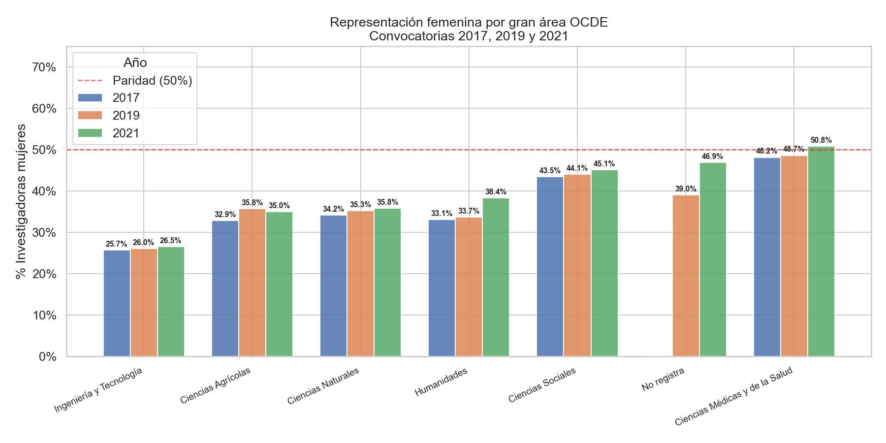
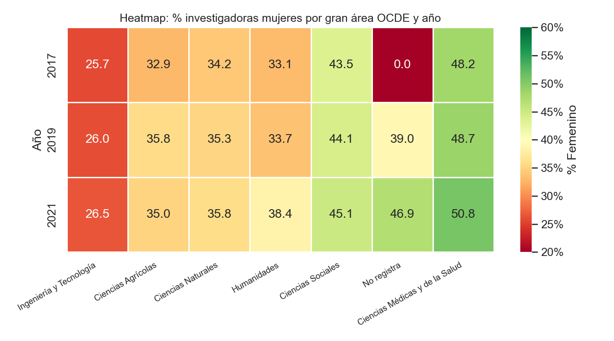
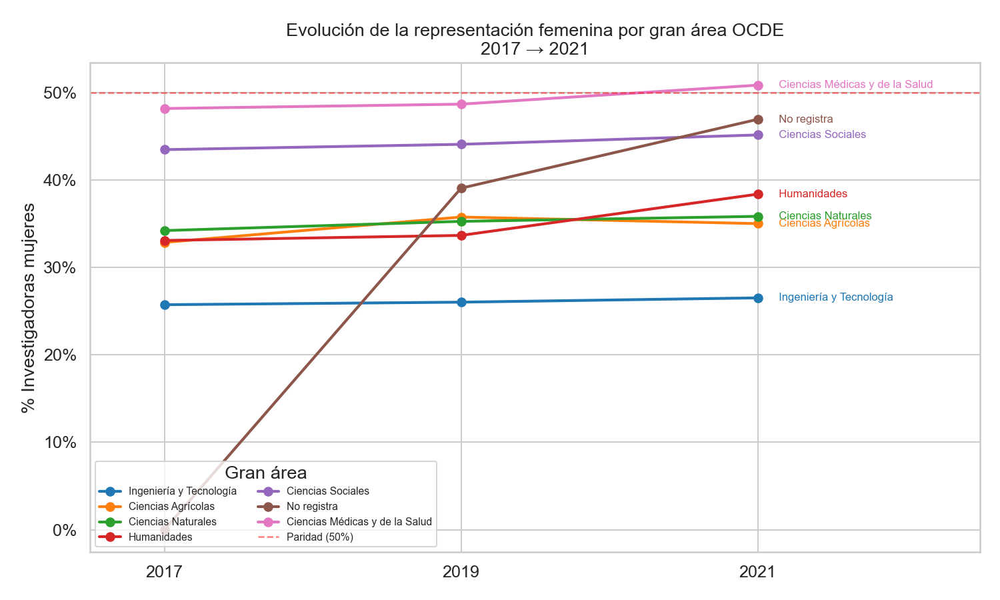
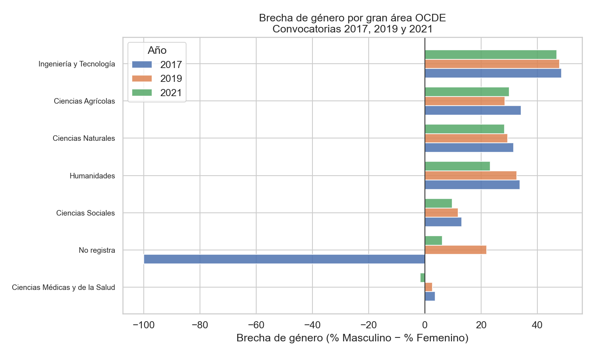

# Informe academico del proyecto y consolidacion del Dashboard Streamlit v2

Universidad Santo Tomas  
Consultoria e Investigacion Ustadistica  
Proyecto: Observatorio MinCiencias - Investigadores Reconocidos  
Fecha de elaboracion: 25 de mayo de 2026

---

## Resumen

El presente informe academico reconstruye el desarrollo completo del proyecto Observatorio MinCiencias - Investigadores Reconocidos a partir de la evidencia disponible en el repositorio, con especial atencion a la secuencia de trabajo, la organizacion por ramas y la produccion de entregables intermedios y finales. En lugar de concentrarse unicamente en el tablero final, el documento describe como el proyecto se fue construyendo desde la consolidacion del repositorio, la preparacion de los datos, la elaboracion de indicadores regionales, la validacion de hallazgos y, finalmente, la publicacion del dashboard_streamlit_v2.

El analisis se realizo mediante revision de historial Git, lectura de la documentacion institucional del proyecto, verificacion de artefactos versionados y reproduccion de resultados a partir de los archivos finales de indicadores en CSV. La evidencia muestra una organizacion de trabajo basada en Git Flow y sprints, donde la rama develop cumple la funcion de integracion general, mientras que Develop_PaulaB, develop_mariap y develop_victorD concentran contribuciones especificas de analitica territorial, diversidad, redes de colaboracion y visualizacion.

En la version final se consolidan 15 indicadores regionales con datos precalculados en datos/processed/indicadores, lo que permitio un despliegue web estable en Streamlit Cloud sin dependencia de rutas locales. Los resultados muestran una fuerte concentracion de la produccion en Distrito Capital, desempenos diferenciales por region en crecimiento, renovacion y permanencia, y patrones de colaboracion y composicion interna que enriquecen la interpretacion territorial del sistema de investigacion.

Palabras clave: Minciencias, Streamlit, Git Flow, indicadores regionales, trazabilidad, analitica territorial.

---

## 1. Introduccion

El proyecto Observatorio MinCiencias - Investigadores Reconocidos se desarrollo como un ejercicio de analitica aplicada con vocacion reproducible, orientado a estudiar convocatorias de investigadores reconocidos en Colombia desde una perspectiva longitudinal, territorial y de colaboracion institucional. La estructura del repositorio evidencia una logica de trabajo por sprints, con documentacion, scripts, artefactos y resultados organizados para sostener trazabilidad y revision posterior.

El proceso no inicio directamente con la construccion del tablero, sino con la definicion de una estructura de repositorio, la consolidacion de fuentes de datos, la preparacion de transformaciones y la generacion progresiva de productos intermedios. A partir de esa base se desarrollaron resultados analiticos y visuales que, en la etapa final, se integraron en dashboard_streamlit_v2 como mecanismo de consulta y divulgacion en linea.

---

## 2. Objetivos del informe

### 2.1 Objetivo general

Documentar de forma academica, trazable y verificable el proceso tecnico y analitico desarrollado en el repositorio, desde el inicio de la organizacion del proyecto hasta la consolidacion de los entregables finales implementados en dashboard_streamlit_v2.

### 2.2 Objetivos especificos

1. Reconstruir los aportes de las ramas Develop_PaulaB, develop_mariap, develop_victorD y develop mediante evidencia Git.
2. Describir la arquitectura funcional del dashboard_streamlit_v2 y su dependencia de datos procesados.
3. Reportar resultados de los indicadores finales con base en los CSV versionados.
4. Integrar evidencias visuales y referencias documentales bajo una estructura de informe academico.

---

## 3. Metodologia

Se aplico una estrategia de revision documental y tecnica en cuatro etapas. Primero se reviso la organizacion oficial del repositorio para identificar la logica de carpetas, entregables y convenciones de trabajo. En segundo lugar, se analizaron las ramas y commits relevantes para reconstruir la secuencia de desarrollo y determinar que produjo cada linea de trabajo. Posteriormente se verificaron artefactos, evidencias y documentos finales en docs, hallazgos y artifacts. Finalmente, se recalcularon resultados agregados a partir de los CSV versionados que alimentan el dashboard.

La metodologia es coherente con una implementacion por sprints y con una logica de integracion progresiva tipo Git Flow, en la que los productos analiticos no se generan de una sola vez, sino por acumulacion de etapas verificables.

## 4. Desarrollo del proyecto y secuencia de ejecucion

El proyecto se fue construyendo de manera incremental. En una primera fase, la prioridad fue organizar el repositorio, delimitar las carpetas de datos, codigo, hallazgos y documentacion, y dejar una base de trabajo comprensible para colaboracion entre integrantes. La estructura general del repositorio y la guia de organizacion confirman ese enfoque, porque distinguen con claridad entre datos, scripts reutilizables, notebooks historicos, resultados finales y documentacion.

Una segunda fase consistio en consolidar bases de datos y scripts de transformacion. La evidencia de commits muestra la produccion de archivos de consolidacion, filtrado y revision de match, asi como la generacion de parquet procesado y CSV derivados. Esta etapa fue necesaria para convertir fuentes heterogeneas en insumos consistentes para el analisis posterior.

En una tercera fase, cada rama especializada aporto un componente distinto del proyecto. La rama develop_victorD se concentro en la construccion y ajuste de redes, mapas y visualizaciones; develop_mariap priorizo la produccion de indicadores regionales y la documentacion de resultados; mientras que Develop_PaulaB reunio la version de publicacion del dashboard regional y los datos minimos requeridos para desplegarlo en linea. La rama develop funciono como eje de integracion de los avances que posteriormente se consolidaron en entregables de mayor alcance.

La ultima fase estuvo orientada a validacion y publicacion. Alli se verifico que el dashboard_streamlit_v2 pudiera ejecutarse sin depender del entorno local del autor, usando los datos finales versionados en el repositorio. Esa decision no es solo tecnica, sino metodologica: al mantener los insumos dentro de una ruta estable y versionada, el proyecto gana reproducibilidad y puede ser revisado por terceros sin ambiguedades.

---

## 5. Evidencia de ramas y trazabilidad de trabajo

### 5.1 Rama develop (integracion)

La rama develop registra la integracion de cambios por pull request y consolidacion de entregables. Entre los commits de referencia aparece el merge e90efca (Merge pull request #38 desde develop_mariap), junto con otros commits de reorganizacion y cierre de sprint.

### 5.2 Rama develop_mariap

Se observa evidencia de desarrollo en indicadores regionales y organizacion documental. Un commit representativo es fef9d04, donde se reorganizan archivos de los issues 41 y 43, incluyendo:

- docs/issue_41/propuesta.md
- docs/issue_43/indicadores_issue43.html
- src/issue_43/calcular_indicadores_regionales.py
- src/issue_43/generar_html_issue43.py

### 5.3 Rama develop_victorD

La rama contiene aportes de modelado y visualizacion de red institucional, asi como ajustes de robustez. El commit c7f53f3 corrige un ZeroDivisionError al filtrar redes por ano, modificando:

- app/streamlit_app.py
- src/modelo/redes.py
- src/visualizacion/redes.py

### 5.4 Rama Develop_PaulaB

La rama incorpora la version final del dashboard regional en Streamlit y los datos minimos para despliegue web. El commit 312370f agrega:

- app/dashboard_streamlit_v2.py
- app/dashboard_streamlit_final.py
- datos/processed/indicadores/*.csv (set minimo requerido)
- datos/processed/co.json
- datos/processed/co_shp.zip
- requirements.txt

Al corte de este informe, la rama Develop_PaulaB tiene divergencia frente a develop (20 commits unicos en develop y 6 commits unicos en Develop_PaulaB), lo cual indica que el tablero regional fue preparado como linea especifica de publicacion.

---

## 6. Arquitectura funcional del dashboard_streamlit_v2

### 6.1 Estructura de ejecucion

El archivo principal de interfaz es app/dashboard_streamlit_v2.py y se apoya en app/dashboard_streamlit_final.py como modulo base para:

- carga de datos
- definicion de metricas
- estandarizacion de regiones
- generacion de graficos de apoyo
- logica de analisis dinamico

### 6.2 Ruta de datos para despliegue en nube

La ruta de entrada de indicadores se configura en:

- INPUT_DIR = datos/processed/indicadores

Esta decision permite que la aplicacion funcione en Streamlit Cloud sin depender de rutas locales del computador del autor.

### 6.3 Indicadores incluidos

El dashboard v2 consolida 15 indicadores regionales derivados de los archivos 01 a 16 (con excepcion del 13 como detalle), incluyendo produccion total, participacion, promedio por grupo, especializacion, diversidad, permanencia, crecimiento, renovacion y composicion por clasificacion y convocatoria.

---

## 7. Resultados finales del dashboard_streamlit_v2

Los siguientes resultados se calcularon sobre los archivos versionados en datos/processed/indicadores, aplicando las agregaciones configuradas en la logica del dashboard.

### 7.1 Region lider por indicador (vista general)

| Indicador | Region lider | Valor lider |
|---|---|---:|
| 1. Produccion total por region | Distrito Capital | 413229 |
| 2. Participacion regional | Distrito Capital | 33.3021 |
| 3. Produccion promedio por grupo | Caribe | 235.1502 |
| 4. Produccion por clasificacion | Distrito Capital | 413229 |
| 5. Diversificacion de productos | Distrito Capital | 75 |
| 6. IEP | Caribe | 1.1947 |
| 7. Diversidad relativa | Distrito Capital | 98.6842 |
| 8. Permanencia grupos | Caribe | 67.2875 |
| 9. Crecimiento neto 2017-2021 | Llano | 69.0909 |
| 10. Fortaleza A1/A 2021 | Eje Cafetero | 44.6103 |
| 11. Tasa de renovacion | Llano | 53.7634 |
| 12. Distribucion por genero (mapa por productos) | Eje Cafetero | 138849 |
| 13. Evolucion 2017-2021 (tasa grupos crecen) | Caribe | 76.4906 |
| 14. Participacion por clasificacion | Centro Oriente | 20 |
| 15. Participacion por clasificacion/convocatoria | Llano | 21.4286 |

### 7.2 Produccion total por convocatoria (indicador 1b)

| Convocatoria | Produccion total nacional |
|---:|---:|
| 2017 | 271924 |
| 2019 | 444448 |
| 2021 | 524478 |

### 7.3 Region lider por convocatoria en produccion total

| Convocatoria | Region lider | Produccion |
|---:|---|---:|
| 2017 | Distrito Capital | 99521 |
| 2019 | Distrito Capital | 144937 |
| 2021 | Distrito Capital | 168771 |

### 7.4 Interpretacion academica de resultados

Desde una lectura territorial, el tablero evidencia una concentracion sostenida de la produccion en Distrito Capital. Sin embargo, otros indicadores muestran dinamicas complementarias: Caribe lidera en intensidad promedio y permanencia, Llano destaca en crecimiento neto y renovacion, y Eje Cafetero presenta alta fortaleza relativa en A1/A. Esta diferenciacion sugiere que la evaluacion regional no debe limitarse al volumen absoluto, sino integrar medidas de estructura y evolucion.

---

## 8. Evidencias visuales del proceso (imagenes del repositorio)

A continuacion se incluyen figuras existentes en el repositorio como evidencia grafica del trabajo desarrollado en sprints previos y su articulacion con la salida final.

  

<em>Figura 1. Participacion femenina por gran area OCDE (evidencia sprint 2).</em>

  

<em>Figura 2. Heatmap de participacion femenina por gran area y convocatoria.</em>

  

<em>Figura 3. Evolucion temporal de participacion femenina.</em>

  

<em>Figura 4. Brecha de genero por area de conocimiento.</em>

---

## 9. Discusion

Los resultados muestran continuidad entre los hallazgos historicos del proyecto (concentracion territorial y asimetrias de representacion) y la visualizacion final en dashboard_streamlit_v2. La principal fortaleza metodologica del cierre consiste en separar claramente la etapa de calculo (scripts y artefactos de datos) de la etapa de comunicacion (dashboard en linea), lo cual mejora reproducibilidad y facilita la evaluacion docente.

Desde la perspectiva de gestion de repositorio, la coexistencia de ramas tematicas permitio desarrollo paralelo, pero genero divergencias que requieren estrategia formal de integracion final para evitar fragmentacion de resultados. Aun asi, el uso de evidencias en hallazgos y docs mantiene trazabilidad suficiente para reconstruir el proceso completo.

---

## 10. Conclusiones

1. El repositorio conserva evidencia verificable del trabajo por sprints y por ramas, permitiendo reconstruccion academica del proceso sin depender de memoria oral.
2. La rama Develop_PaulaB consolida un tablero regional funcional para despliegue en Streamlit Cloud, con dependencias y datos minimos versionados.
3. Los 15 indicadores del dashboard permiten lectura multivariable del desempeno regional: volumen, participacion, diversificacion, estabilidad, renovacion y composicion por clasificacion.
4. El patron dominante de liderazgo en volumen corresponde a Distrito Capital, mientras otras regiones lideran en indicadores estructurales especificos, lo que enriquece la interpretacion territorial.
5. La estandarizacion de rutas de datos en datos/processed/indicadores resuelve el principal riesgo de no reproducibilidad en entorno nube.

---

## 11. Limitaciones y recomendaciones

### 10.1 Limitaciones

- Persisten divergencias entre develop y Develop_PaulaB al momento del corte, por lo que algunos aportes recientes pueden no estar totalmente sincronizados en una unica rama de entrega.
- Parte de la evidencia visual historica esta en HTML y no siempre en imagen estatica, lo que puede dificultar su insercion directa en documentos impresos.

### 10.2 Recomendaciones

1. Definir una rama de cierre academico para consolidar todo el material final validado.
2. Mantener una matriz unica de trazabilidad issue-commit-archivo en docs.
3. Exportar capturas oficiales del dashboard_streamlit_v2 en ejecucion para anexos de presentacion final.

---

## 12. Referencias (formato APA 7)

Departamento Administrativo Nacional de Estadistica. (2018). Censo Nacional de Poblacion y Vivienda 2018. https://www.dane.gov.co

Departamento Administrativo Nacional de Estadistica. (2018). Encuesta Nacional de Calidad de Vida 2018. https://www.dane.gov.co

Ministerio de Ciencia, Tecnologia e Innovacion. (s. f.). Investigadores reconocidos por convocatoria (2017, 2019, 2021). Datos Abiertos Colombia. https://www.datos.gov.co/Ciencia-Tecnolog-a-e-Innovaci-n/Investigadores-Reconocidos-por-convocatoria/bqtm-4y2h/about_data

Ustadistica. (2026). Observatorio MinCiencias - Investigadores Reconocidos (Rama Develop_PaulaB) [Repositorio de software]. GitHub. https://github.com/ustadistica/Observatorio_Ministerio_de_Ciencias_Grupo7

---

## 13. Anexo de trazabilidad minima usada en este informe

Documentos base:

- README.md
- docs/sprint_4_informe_final.md
- docs/organizacion_repositorio.md

Archivos tecnicos del tablero final:

- app/dashboard_streamlit_v2.py
- app/dashboard_streamlit_final.py
- datos/processed/indicadores/*.csv
- datos/processed/co.json
- datos/processed/co_shp.zip
- requirements.txt

Commits de referencia:

- 312370f (Develop_PaulaB)
- b683605 (Develop_PaulaB)
- e90efca (develop)
- fef9d04 (develop_mariap)
- c7f53f3 (develop_victorD)
