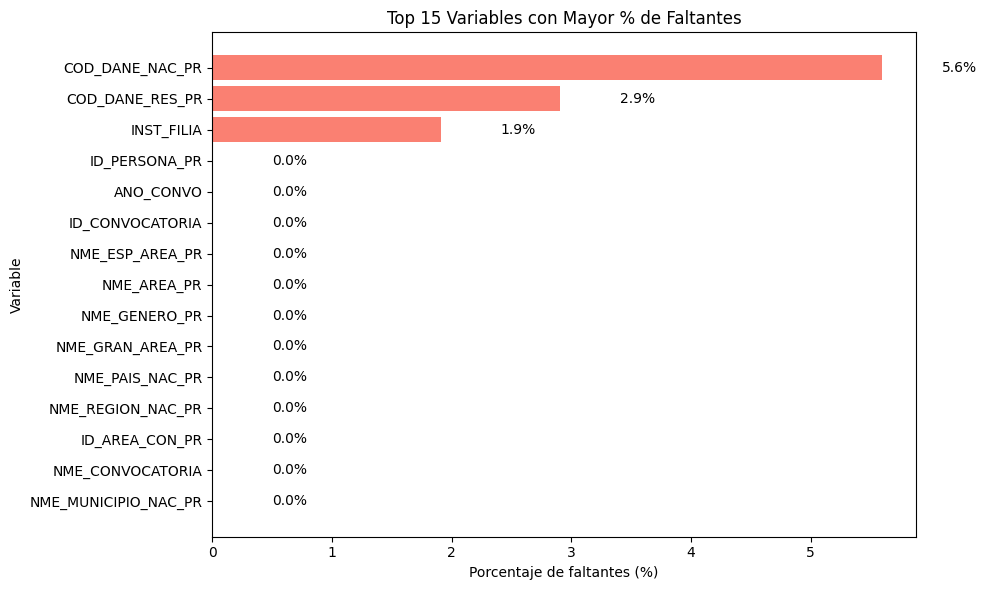
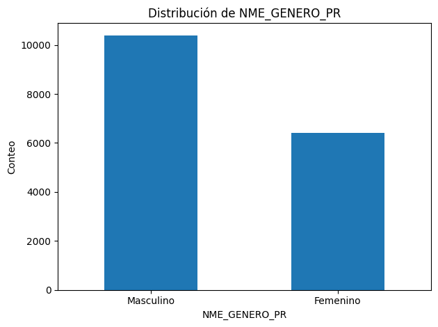
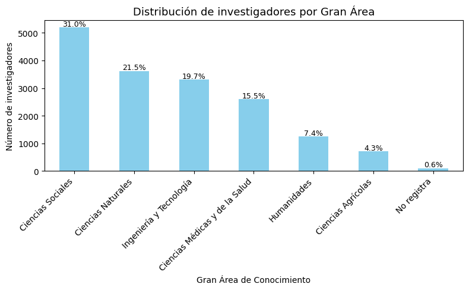
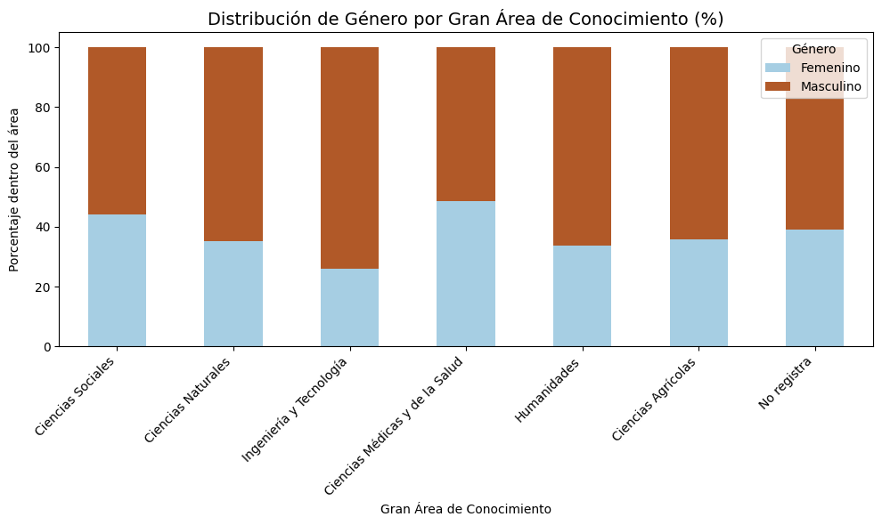

# Análisis de la Base de Datos 2019 – Convocatoria de Reconocimiento de Investigadores (Minciencias)

## 1. Descripción general
La base contiene **16.796 registros** y **30 variables**, correspondientes a los investigadores reconocidos el 2019

- **23 variables categóricas**: género, departamento de nacimiento, residencia, región, gran área de conocimiento, etc.
- **7 variables numéricas**: principalmente identificadores y códigos (`ID_…`, `COD_…`, `NRO_…`).

## 2. Calidad de los datos
- **Valores faltantes**: ninguna variable supera el 50% de vacíos.
- **Cardinalidad**: variables como municipios e instituciones presentan muchos niveles; otras (género, región, gran área) son de baja cardinalidad y útiles para análisis.
- **Identificadores**: `ID_PERSONA_PR` es altamente único y sirve como llave de investigador.

## 3. Perfil demográfico
### Género (`NME_GENERO_PR`)
- Masculino: **61,83%**
- Femenino: **38,17%**

> Existe una **brecha de género** importante en la comunidad científica reconocida.

### Región de residencia (`NME_REGION_RES_PR`)
| Región             | % sobre total |
|--------------------|---------------|
| Distrito Capital   | 31,99%        |
| Eje Cafetero       | 23,27%        |
| Caribe             | 15,72%        |
| Centro Oriente     | 11,97%        |
| Pacífico           | 10,80%        |

> Más del 60% de los investigadores residen en **Bogotá y el Eje Cafetero**.

### Departamento de residencia (`NME_DEPARTAMENTO_RES_PR`)
- Bogotá D. C.: **31,99%**
- Antioquia: **17,38%**
- Valle del Cauca: **7,84%**
- Atlántico: **7,70%**
- Santander: **5,17%**

> Estos cinco departamentos concentran cerca del **70% de los investigadores** reconocidos.

### Departamento de nacimiento (`NME_DEPARTAMENTO_NAC_PR`)
- Bogotá D. C.: **25,36%**
- Antioquia: **14,47%**
- Valle del Cauca: **7,95%**
- Santander: **6,06%**
- Atlántico: **5,40%**
- Exterior: **5,36%**

> Destaca la categoría **Exterior**, que indica investigadores nacidos fuera del país.

## 4. Gran Área de Conocimiento (`NME_GRAN_AREA_PR`)
El análisis muestra la concentración de investigadores en campos específicos:

- Ciencias Sociales y Humanas
- Ciencias Médicas y de la Salud
- Ciencias Naturales
- Ingenierías y Tecnologías
- Ciencias Agrícolas

> El gráfico evidencia que las **ciencias sociales y de la salud** tienen mayor representación.

## 5. Cruce Gran Área × Género
Se realizó un cruce de género dentro de cada área de conocimiento:

- En todas las áreas predomina la **participación masculina**.
- **Ciencias Sociales y Humanas** y **Ciencias Médicas y de la Salud** presentan mayor proporción femenina.
- En **Ingenierías y Tecnologías** la presencia de mujeres es marcadamente menor.

## 6. Distribución geográfica y brechas
- La brecha de género se mantiene relativamente constante en todas las regiones.
- Bogotá D. C. y Antioquia concentran casi el 50% de los investigadores.
- Existe una **centralización de la actividad investigadora** en los principales polos académicos del país.

## 7. Conclusiones
1. La investigación en Colombia está altamente centralizada en Bogotá, Antioquia y Valle del Cauca.
2. Persiste una **brecha de género**: 6 de cada 10 investigadores reconocidos son hombres.
3. La participación femenina es relativamente más alta en áreas sociales y de salud, pero baja en ingenierías y ciencias exactas.
4. La base es **completa y confiable**, con bajo nivel de faltantes.

---
